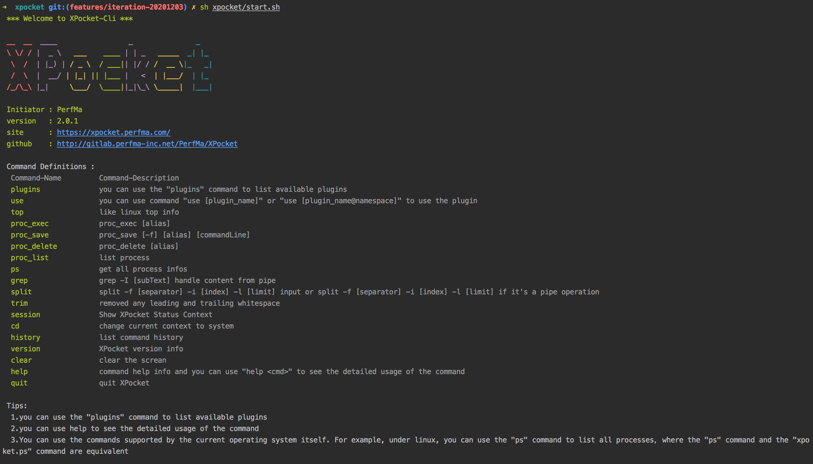
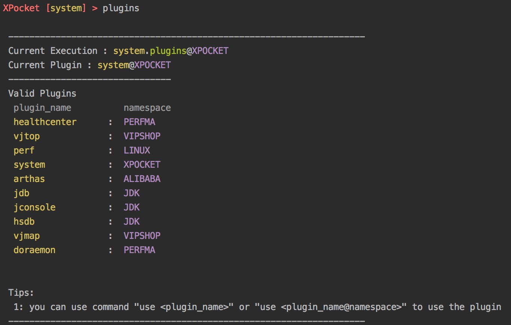
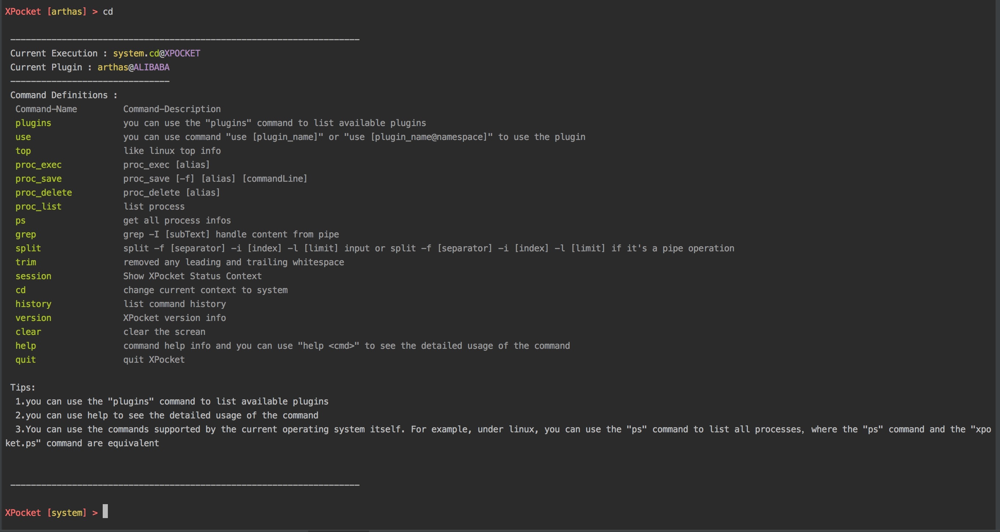
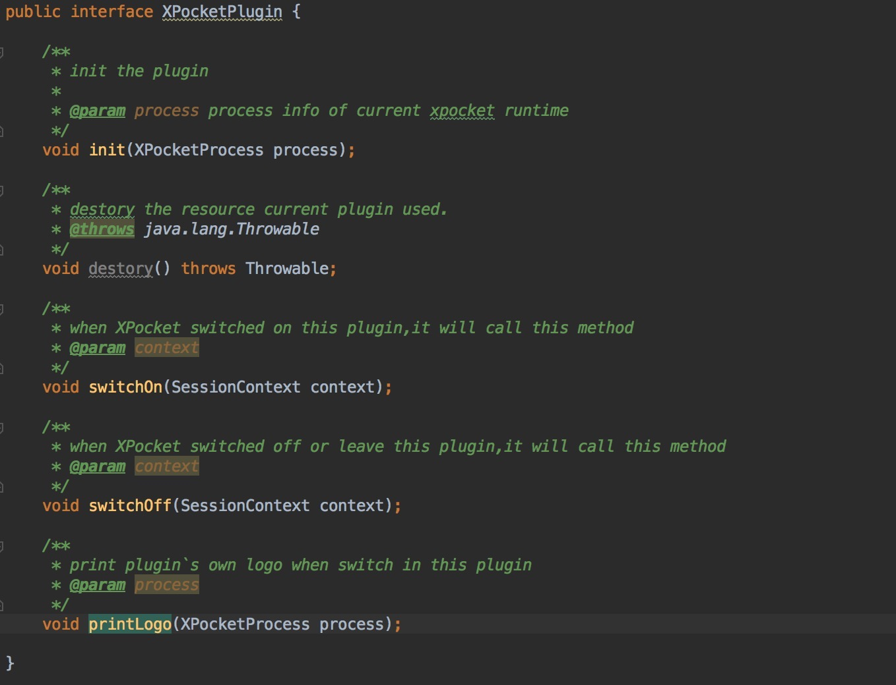
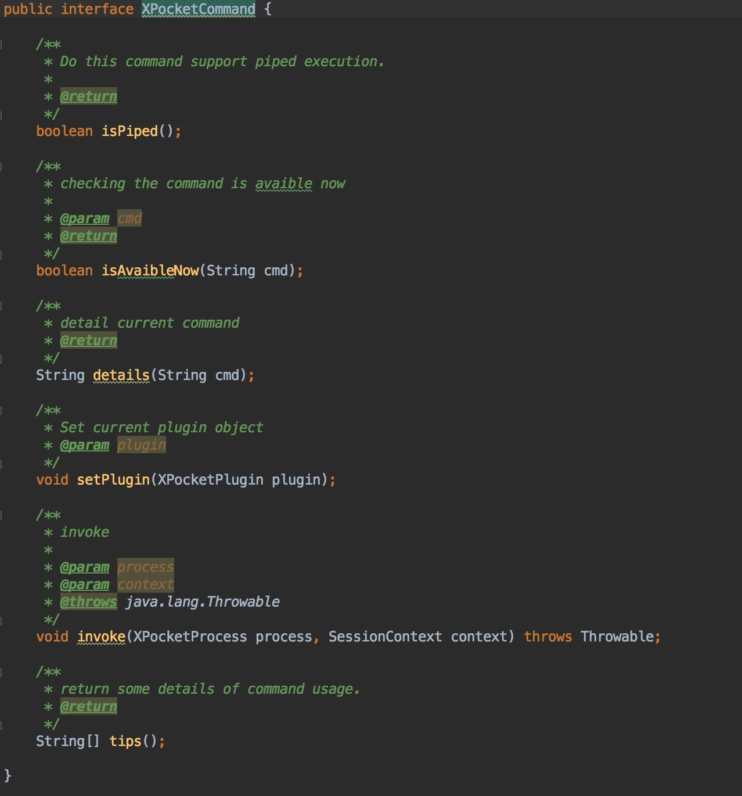
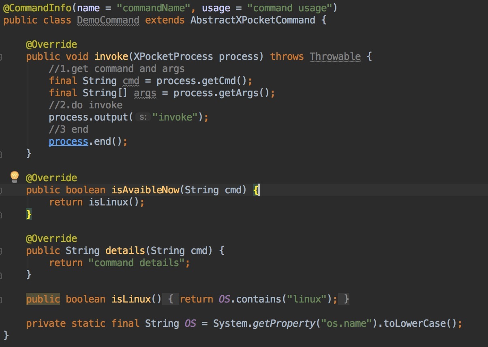
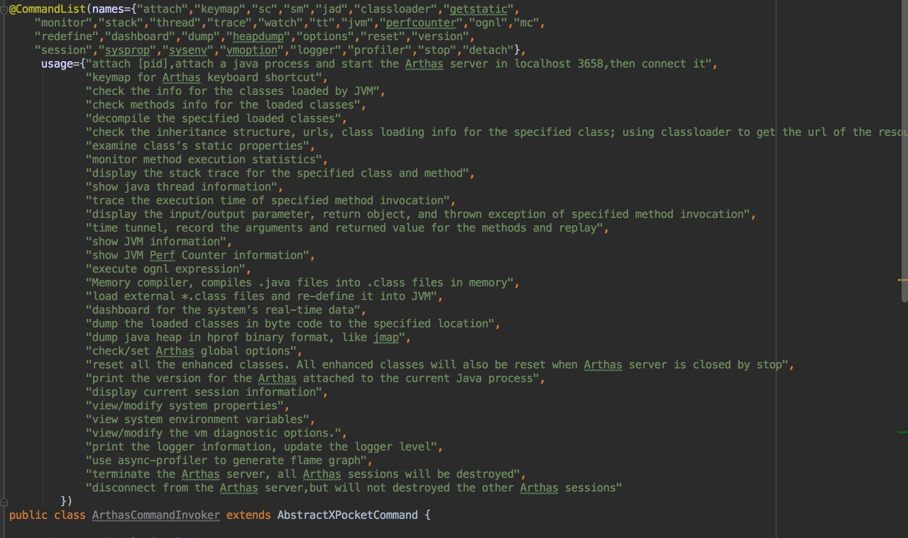

## XPocket


`XPocket` 是PerfMa开源的一套工具整合方案，集合了多个优秀的开源工具，工具之间可以相互配合的进行工作，开发人员也可以快速的开发属于自己的插件。

当你遇到以下类似问题时，`XPocket`可以帮助到你：

0. 问题排查时一头雾水，不知道用什么工具？
0. 查找工具，下载和安装都很浪费时间？
0. 想自己快速开发一个实用的工具？
0. 排查问题十分繁琐，想尽量简化排查方案以供后续使用？

`XPocket`支持JDK 6+，支持Linux/Mac/Windows，采用命令行交互模式，提供丰富的 `Tab` 自动补全功能，支持管道操作。


### 在线教程(推荐)

* [基础教程](http://xpocket.saas.perfma-inc.net/tutorials/)

### 一 快速开始

#### 1.下载模拟程序perfma-simulator-2.0.0-RELEASE-ear.tar.gz，解压并运行
```bash
wget http://192.168.100.104:17961/api/community/plugin/down/simulator.gz
tar -xvf  simulator.gz
cd simulator
sh run.sh
cd
```

#### 2.下载XPocket-2.0.0-RELEASE-ear.tar.gz，然后解压并运行
```bash
wget http://192.168.100.104:17961/api/community/plugin/down/xpocket.gz
tar -xvf  xpocket.gz
sh xpocket/start.sh
```
启动成功后如下所示



#### 3.使用插件
1.查看插件列表
```bash
plugins
```
列表如下图所示


2.使用命令 use + pluginName 来使用插件，如`use arthas@ALIBABA`
```bash
use arthas@ALIBABA
```

#### 4.切换插件
重复上一个步骤使用插件即可

#### 5.退出插件
XPocket退出插件的方式很简单，只需要使用命令 `cd` 即可，cd命令可以退出当前插件，使得当前的操作空间回到系统层，如下图所示。


#### 6.退出XPocket

退出XPocket使用命令 `quit` 即可，如下图所示


### 二 插件开发
插件开发主要包括以下的几个要素：
- XPocketPlugin （主要负责处理插件生命周期相关的工作，非必要）
- XPocketCommand （封装了命令实现，必要）
- xpocket.def (配置文件，必要)

#### 1.XPocketPlugin

作为一个接口，如果插件有一些资源准备工作以及资源销毁等操作，那么可以自己实现这个接口。
- init：插件的初始化工作
- destory：负责资源释放
- switchOn：开启插件时会调用
- switchOff：退出插件时会调用
- printLogo：插件自定义logo的打印

XPocket也提供了一个空实现 AbstractXPocketPlugin，用户使用的时候可以继承AbstractXPocketPlugin并自己实现相关逻辑，如果插件不需要进行相关的工作，那么xpocketPlugin并非是必要的。

#### 2.XPocketCommand

自定义命令所需要实现的接口
- isPiped：是否支持管道操作
- isAvaibleNow：当前是否可用
- details：命令的消息介绍
- setPlugin：设置所属插件
- invoke：命令的执行逻辑
- tips：命令相关的tips信息

##### Demo
XPocket提供了一个默认的抽象类实现AbstractXPocketCommand以供程序员开发命令时使用,如下所示。

注解CommandInfo负责提供命令的基本描述信息，如果希望同时提供多个命令的描述信息，那么可以使用注解CommandList，如下所示。


#### 3.xpocket.def

包含一些必要的配置信息，主要的配置项包括
- plugin-name
- plugin-namespace
- main-implementation
- plugin-description
- usage-tips
- plugin-author
- github
- plugin-project
- tools-author
- tools-project
- plugin-command-package

##### Demo


#### 4.使用自定义插件
- 打包自定义插件
- 将打包好的插件的jar包放在xpocket/plugins目录下
- 重新启动xpocket

