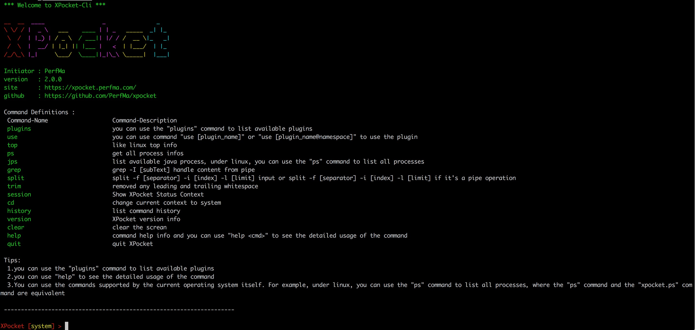
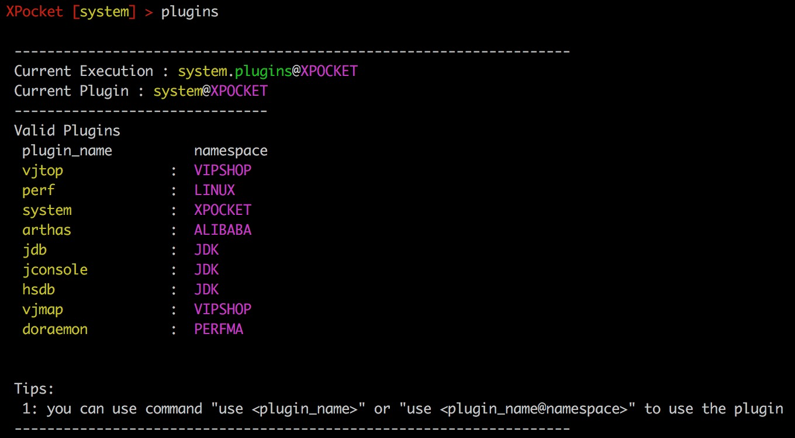
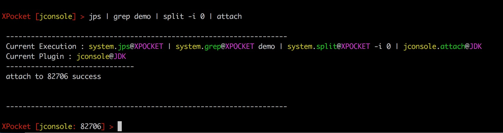
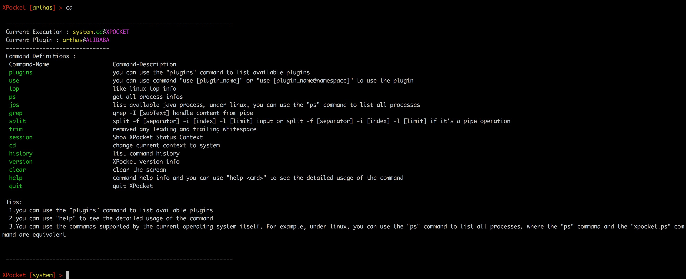

# XPocket 用户文档


`XPocket` 是PerfMa开源的工具容器框架，用于集成现有的或新开发的工具，统一用户UI与交互体验；使工具开发者只需要关注核心逻辑的开发，并且使XPocket的用户可以以相同的交互体验使用大量不同的工具。
目前XPocket生态已经实现了HSDB、JDB、JConsole、Perf、Arthas等多个优秀的开源工具的插件化集成，现阶段主要侧重性能领域。

同时XPocket建立了一套不同工具间进行数据和行为交互的机制，使得XPocket容器中的多个工具可以实现管道式的协同工作。

当你遇到以下类似问题时，`XPocket`可以帮助到你：
1. 系统存在性能问题？
2. 问题排查时一头雾水，无从下手？
3. 使用一个新的工具，下载、文档、安装完就下班了？
4. 好不容易用起来，只因输出不合理就又要去找新工具？ 
5. 有些自己实现的小工具散落各处？
6. 排查过的问题记不记住全凭脑子？

`XPocket`支持JDK 8+，支持Linux/Mac/Windows，采用命令行交互模式，提供丰富的 `Tab` 自动补全功能，支持管道操作。

## 插件开源生态
* [XPocket plugin HSDB](https://github.com/PerfMa/xpocket-plugin-hsdb)
* [XPocket plugin JDB](https://github.com/PerfMa/xpocket-plugin-jdb)
* [XPocket plugin JConsole](https://github.com/PerfMa/xpocket-plugin-jconsole)
* [XPocket plugin Perf](https://github.com/PerfMa/xpocket-plugin-perf)
* [XPocket plugin Arthas](https://github.com/PerfMa/xpocket-plugin-arthas)
* [XPocket plugin VJMap](https://github.com/PerfMa/xpocket-plugin-vjmap)


## XPocket在线教程

* [基础教程](https://xpocket.perfma.com/tutorials/)

## XPocket官方网站

* [xpocket.perfma.com](https://xpocket.perfma.com/)

## XPocket插件中心

* [plugin.xpocket.perfma.com](https://plugin.xpocket.perfma.com/)


## 快速开始

### 1.下载模拟程序，解压并运行
```bash
wget https://a.perfma.net/xpocket/download/XPocket-demo.tar.gz
tar -xvf  XPocket-demo.tar.gz
cd simulator
sh run.sh
```

### 2.下载xpocket，然后解压并运行（注：如果您当前的jdk版本大于jdk8，请使用xpocket_jdk9+.sh）
```bash
wget https://a.perfma.net/xpocket/download/XPocket.tar.gz
tar -xvf  XPocket.tar.gz
sh xpocket/xpocket_jdk8.sh
```
启动成功后如下所示



### 3.使用插件
1.查看插件列表
```bash
plugins
```
列表如下图所示


2.使用命令 use + pluginName 或者 use + pluginName@NameSpace 来使用插件，例
```bash
use jdb@JDK
```

### 4.切换插件
- 查看插件列表
- 使用 use + pluginName 或者 use + pluginName@NameSpace 来使用插件

### 5.获取帮助
利用help命令来获取更多帮助信息 

- 获取插件相关的帮助信息 : help + pluginName@NameSpace ，例如。
```bash
help jdb@JDK
```

- 获取命令相关的帮助信息 : help + pluginName.commandName （如果已经切换到插件的操作空间下，可以直接使用 help + commandName 的方式）,例如。
```bash
help jdb.cont
```

- 切换到某个插件的操作空间下后，可以通过help命令查看当前插件的命令列表。

### 6.管道操作
场景：当前插件位于JConsole下，需要attach上我们的demo程序。

- 常规操作（jps -> 获取demo程序的pid -> 使用attach命令attach目标进程）。

- XPocket的管道操作只需一条命令即可（jps | grep demo | split -i 0 | attach），如下所示。


### 7.退出插件
XPocket退出插件的方式很简单，只需要使用命令 `cd` 即可，cd命令可以退出当前插件，使得当前的操作空间回到系统层，如下图所示。


### 8.退出XPocket

退出XPocket使用命令 `quit` 即可，如下图所示


## 插件开发
详情请见[开发者指南](https://xpocket.perfma.com/docs/developer/)


## 现有插件
### HSDB
#### 简介
探索JVM的运行时数据，强大的JVM运行时状态分析工具（注：由于jdk8以上开始实施模块化，导致HSDB与其的运行机制不兼容）。

#### 操作指南
```
Command-Name                   Command-Description
  hsdb                         hsdb [path of sa-jdi.jar] start hsdb command line
  
Tips:
  only support Windows platform
```
更多操作以及介绍请参考[官方介绍](https://docs.oracle.com/javase/jp/8/docs/serviceabilityagent/sun/jvm/hotspot/HSDB.html)

[github](https://github.com/perfma/xpocket-plugin-hsdb)

[插件概况](https://plugin.xpocket.perfma.com/plugin/54)

### JDB 
#### 简介 
Java调试器（JDB）是Java类在命令行中调试程序的工具， 它实现了Java平台调试器体系结构， 它有助于使用Java调试接口（JDI）检测和修复Java程序中的错误。

#### 操作指南
```
 Command-Name                   Command-Description
   jdb                          jdb <options> <class> <arguments>

 Tips:
 1.使用jdb -help获取详细帮助信息。
 2.使用jdb -listconnectors 获取当前支持的所有连接器。
 3.可以使用例如 jdb -connect com.sun.jdi.SocketAttach:hostname=127.0.0.1,port=8000 链接已经开启debug模式的java进程。
 4.使用jdb -classspath .:$CLASS_PATH 来启动jdb会话（windows上需要使用;分隔多个路径），然后通过stop in/at 设置断点并使用run启动一个可以被debug的java进程。
 5.启动jdb会话以后也可以通过help命令获取详细帮助。
```
更多操作以及介绍请参考[官方介绍](https://docs.oracle.com/javase/8/docs/technotes/tools/windows/jdb.html)

[github](https://github.com/perfma/xpocket-plugin-jdb)

[插件概况](https://plugin.xpocket.perfma.com/plugin/56)

### Perf 
#### 简介
Perf功能强大，它可以检测CPU性能计数器，跟踪点，kprobes和uprobes（动态跟踪），它能够进行轻量级分析。它也包含在Linux内核的tools / perf下，并且经常更新和增强，
Perf最初是在Linux中使用性能计数器子系统的工具，并且进行了各种增强以添加跟踪功能，更详细的内容请参考[Perf介绍](https://perf.wiki.kernel.org/index.php/Main_Page)。

#### 操作指南
```
  Command-Name                   Command-Description
  config                         Get and set variables in a configuration file.
  context-switches               process context-switches detail
  page-faults                    process page-faults detail
  lock                           Analyze lock events
  ftrace                         simple wrapper for kernel's ftrace functionality
  report                         Read perf.data (created by perf record) and display the profile
  analyze                        analyze process cpu usage
  record                         Run a command and record its profile into perf.data
  sched                          Tool to trace/measure scheduler properties (latencies)
  probe                          Define new dynamic tracepoints
  script                         Read perf.data (created by perf record) and display trace output
  version                        display the version of perf binary
  list                           List all symbolic event types
  annotate                       Read perf.data (created by perf record) and display annotated code
  create-java-perf-map           generate /tmp/perf-<pid>.map files for just-in-time(JIT)-compiled methods for use with perf
  stat                           Run a command and gather performance counter statistics
  proc-stat                      process performance stats
```
Perf插件集成了PerfMa自己增加的几条命令如：analyze命令：
analyze -p [pid] （-p 指定进程采集热点）
analyze -detail  查看进程CPU热点抓取结果
同时支持perf原生的命令和参数，并且针对java程序集成了perf-map-agent 这个工具，可以协助显示java的调用栈信息.具体使用方式见命令的帮助信息(如 help analyze)

[github](https://github.com/perfma/xpocket-plugin-perf)

[插件概况](https://plugin.xpocket.perfma.com/plugin/57)

### Arthas 
#### 简介
Arthas 是Alibaba开源的Java诊断工具，深受开发者喜爱，支持JDK 6+，支持Linux/Mac/Windows，采用命令行交互模式，同时提供丰富的 Tab 自动补全功能，进一步方便进行问题的定位和诊断。

#### 操作指南
```
 Command-Name                   Command-Description
   attach                       attach [pid],attach a java process and start the Arthas server in localhost 3658,then connect it

 Tips:
 Arthas allows developers to troubleshoot production issues for Java applications without modifying code or restarting servers.
```

XPocket管控了Arthas在attach进程之前的输入输出，attach之后的具体使用请参考[Arthas官方文档](https://arthas.aliyun.com/doc/)

[github](https://github.com/alibaba/arthas)

[插件概况](https://plugin.xpocket.perfma.com/plugin/52)

### JConsole  
#### 简介
JConsole 是一个内置Java性能分析器，用于对JVM中内存，线程和类等的监控，这款工具的好处在于，占用系统资源少，而且结合Jstat，可以有效监控到java内存的变动情况，以及引起变动的原因。在项目追踪内存泄露问题时，很实用。

#### 操作指南
```
 Command-Name                   Command-Description
   attach                       attach <local jvm pid>
  
 Tips:
 1.使用help获取帮助信息。
 2.更详细的功能，请attach一个进程后使用
```

注：插件化后的JConsole相比gui版本的JConsole在显示与操作上有所区别，但是数据的采集方式是一样的。

[github](https://github.com/perfma/xpocket-plugin-jconsole)

[插件概况](https://plugin.xpocket.perfma.com/plugin/55)

### VJMap
#### 简介  
分代版的jmap（新生代，存活区，老生代），是排查内存缓慢泄露，老生代增长过快原因的利器。因为jmap -histo PID 打印的是整个Heap的对象统计信息，而为了定位上面的问题，我们需要专门查看OldGen对象，和Survivor区大龄对象的工具。
vjmap的原始思路来源于R大的TBJMap ，翻新后支持JDK8，支持Survivor区大龄对象过滤。
注意：因为VJMap的原理，只支持CMS和ParallelGC，不支持G1。

#### 操作指南
```
 Command-Name                   Command-Description
   vjmap                        vjmap 1.0.9 - prints per GC generation (Eden, Survivor, OldGen) object details of a given process.

 Tips:
 Usage: vjmap <options> <PID>
 Usage: vjmap <options> <executable java path> <coredump file path>
 Usage "help vjmap" show options info
 
 Example:
  打印整个堆中对象的统计信息，按对象的total size排序:
  vjmap -all PID > /tmp/histo.log
  
  推荐，打印老年代的对象统计信息，按对象的oldgen size排序，比-all快很多，暂时只支持CMS:
  vjmap -old PID > /tmp/histo-old.log
  
  推荐，打印Survivor区的对象统计信息，默认age>=3
  vjmap -sur PID > /tmp/histo-sur.log
  
  推荐，打印Survivor区的对象统计信息，查看age>=4的对象
  vjmap -sur:minage=4 PID > /tmp/histo-sur.log
  
  推荐，打印Survivor区的对象统计信息，单独查看age＝4的对象:
  vjmap -sur:age=4 PID > /tmp/histo-sur.log
 
```

[github](https://github.com/vipshop/vjtools/tree/master/vjmap)

[插件概况](https://plugin.xpocket.perfma.com/plugin/58)

### Doraemon
#### 简介
Doraemon是PerfMa开发的一款链接性能分析产品的体验工具，操作简单，功能强大，提供jvm参数分析，线程离线分析以及内存离线分析的功能

#### 操作指南
```
  Command-Name                   Command-Description
    attach                         attach <local jvm pid>
    detach                         detach
    analyse                        use 'analyse <AbsolutePath>' to analyse memory dump file
    help                           command help info
    
  Tips:
  1.更丰富的操作，请先attach一个进程
```

[插件概况](https://plugin.xpocket.perfma.com/plugin/53)

### 插件中心
更丰富的内容，建议您前往[插件中心](https://plugin.xpocket.perfma.com/)

## Tips
- sa-jdi.jar 主要用于支持插件VJMap的正常使用（注：由于jdk8以上开始实施模块化，导致VJMap的运行机制不兼容）。
- 框架扩展开发的包依赖: com.perfma.xlab:xpocket-framework-spi:2.0.0-RELEASE
